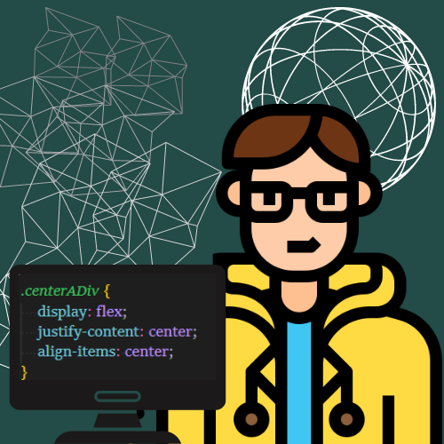

## Opa! Eu sou a Ana Karolina (kasvrol) 🤠

 
   
  

    
🌱 Estudante de Análise e Desenvolvimento de Sistemas na UFPR.

    
🎯 Constantemente estudando para acompanhar as tendências da indústria e atualizar-me as tecnologias que possam melhorar a eficiência do processo de desenvolvimento.

    
📚 Tenho grande interesse e curiosidade pela complexidade e potencial da área de redes e IoT.

    
🤿 Atraída por assuntos relacionados à física e matemática, entusiasta a natação e aficionada por folk.

       <section>
         
        
        
       </section>
   

<h4>⏳ Code Stats:</h4>

   

    
   

